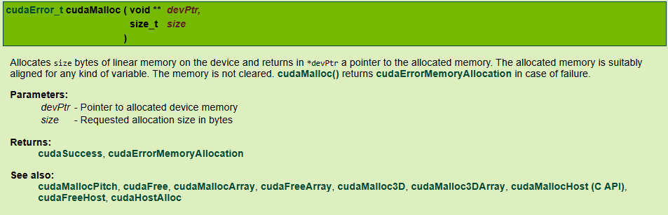
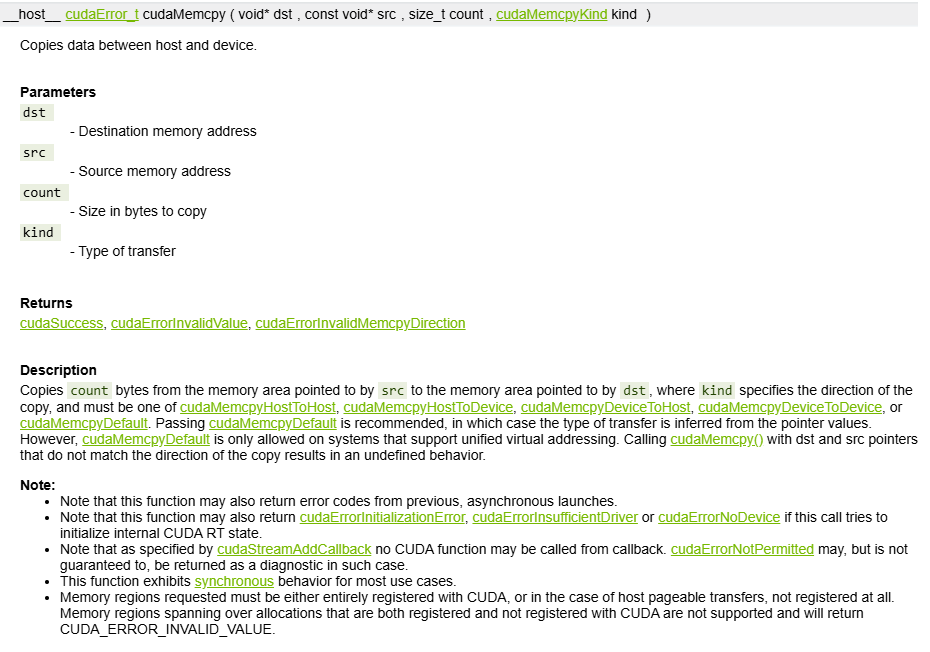
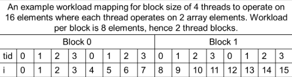
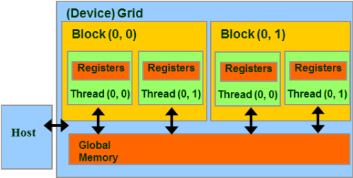
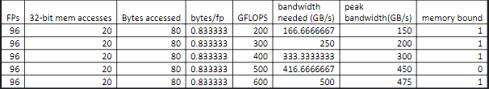

# Quiz1

## Question 1

**Question:** If we want to allocate an array of v integer elements in CUDA device global memory, what would be an appropriate expression for the second argument of the cudaMalloc() call?

**Options:**
- **A:** n * sizeof(int)
- **B:** n
- **C:** v
- **D:** v * sizeof(int)

**Answer:** D

**Explanation:** 



---

## Question 2

**Question:** If we want to allocate an array of n floating-point elements and have a floating-point pointer variable d_A to point to the allocated memory, what would be an appropriate expression for the first argument of the cudaMalloc() call?

**Options:**
- **A:** (void *)d_A
- **B:** n
- **C:** (void **)d_A
- **D:** *d_A

**Answer:** C

**Professor Explanation:** &d_A is pointer to a pointer of float. To convert it to a generic pointer required by cudaMalloc() should use (void **) to cast it to a generic double-level pointer

---

## Question 3

**Question:** If we want to copy 3000 bytes of data from host array h_A (h_A is a pointer to element 0 of the source array) to device array d_A (d_A is a pointer to element 0 of the destination array), what would be an appropriate API call for this in CUDA?

**Options:**
- **A:** cudaMemcpy(h_A, d_A, 3000, cudaMemcpyDeviceTHost)
- **B:** cudaMemcpy(3000,d_A,h_A, cudaMemcpyHostToDevice)
- **C:** cudaMemcpy(3000,h_A,d_A, cudaMemcpyHostToDevice)
- **D:** cudaMemcpy(d_A, h_A, 3000, cudaMemcpyHostToDevice)

**Answer:** D

**Explanation:** 



---

## Question 4

**Question:** How would one declare a variable err that can appropriately receive returned value of a CUDA API call?

**Options:**
- **A:** cudaError_t err;
- **B:** cudaError err;
- **C:** int err;
- **D:** cudaSuccess_t err;

**Answer:** A

---

## Question 5

**Question:** If we want to allocate using Unified Memory an array of n elements of type double and have a pointer variable d_A to point to the allocated memory, what would be the appropriate API call?

**Options:**
- **A:** cudaMallocHost((void **)& d_A, n * sizeof(double) );
- **B:** cudaMalloc((void **)& d_A, n * sizeof(double) );
- **C:** cudaMallocManaged( d_A, n);
- **D:** cudaMallocManaged((void **)& d_A, n * sizeof(double) );

**Answer:** D

**Explanation:** Managed == Unified Memory. cudaMallocManaged() is the API to allocate Unified Memory. The first argument should be a pointer to a pointer to the allocated memory. The second argument is the size of the memory to be allocated in bytes.

---

# Quiz2

## Question 1

**Question:** If we need to use each thread to calculate one output element of a vector addition, what would be the expression for mapping the thread/block indices to data index:

**Options:**
- **A:** i=threadIdx.x + threadIdx.y
- **B:** i=blockIdx.x*blockDim.x + threadIdx.x;
- **C:** i=blockIdx.x * threadIdx.x;
- **D:** i=blockIdx.x + threadIdx.x;

**Answer:** B

---

## Question 2

**Question:** We want to use each thread to calculate two (adjacent) output elements of a vector addition. Assume that variable i should be the index for the first element to be processed by a thread. What would be the expression for mapping the thread/block indices to data index of the first element?

**Options:**
- **A:** i=blockIdx.x*blockDim.x*2 + threadIdx.x;
- **B:** i=blockIdx.x*blockDim.x + threadIdx.x +2;
- **C:** i=(blockIdx.x*blockDim.x + threadIdx.x)*2;
- **D:** i=blockIdx.x*threadIdx.x*2;

**Answer:** D

**Professor Explanation:** Explanation: Every thread covers two adjacent output elements. The starting data index is simply twice the global thread index. Another way to look at it is that all previous blocks cover (blockIdx.x*blockDim.x)*2. Within the block, each thread covers 2 elements so the beginning position for a thread is threadIdx.x.

---

## Question 3

**Question:** We want to use each thread to calculate two output elements of a vector addition. Each thread block processes 2*blockDim.x consecutive elements that form two sections. All threads in each block will first process a section, each processing one element. They will then all move to the next section, again each processing one element. Assume that variable i should be the index for the first element to be processed by a thread. What would be the expression for mapping the thread/block indices to data index of the first element? Example thread to data mapping is shown below with thread 0 in block 0 operating on two array elements indexed as 0 and 4 and thread 1 in the same block operating on elements indexed as 1 and 5. Stride amount is the block size of 4 in this example.



**Options:**
- **A:** i=blockIdx.x*blockDim.x*2 + threadIdx.x;
- **B:** i=(blockIdx.x*blockDim.x + threadIdx.x)*2;
- **C:** i=blockIdx.x*blockDim.x + threadIdx.x + 2;;
- **D:** i=blockIdx.x*threadIdx.x*2;

**Answer:** A

**Professor Explanation:** Explanation: Each previous block covers (blockIdx.x*blockDim.x)*2. The beginning elements of the threads are consecutive in this case so just add threadIdx.x to it

**Explanation:** 

---

## Question 4

**Question:** For a vector addition, assume that the vector length is 8000, each thread calculates one output element, and the thread block size is 1024 threads. The programmer configures the kernel launch to have a minimal number of thread blocks to cover all output elements. How many threads will be in the grid?

**Options:**
- **A:** 8000
- **B:** 8200
- **C:** 8196
- **D:** 8192

**Answer:** D

**Explanation:** 1024 * 8 = 8192. 8192 threads are launched in the grid. 8000 elements are covered by 8192 threads. The remaining 192 threads are not used.

---

# Quiz3

## Question 1

**Question:** If we want to use each thread to calculate two output elements of a vector addition, what would be the expression for mapping the thread/block indices to data index of the first element?

**Options:**
- **A:** i=blockIdx.x*blockDim.x*2 + threadIdx.x;
- **B:** i=blockIdx.x*blockDim.x + threadIdx.x +2;
- **C:** i=(blockIdx.x*blockDim.x + threadIdx.x)*2;
- **D:** i=blockIdx.x*threadIdx.x*2;

**Answer:** A

---

## Question 2

**Question:** Assume that a kernel is launched with 800 thread blocks each of which has 256 threads. If a variable is declared as a local memory variable, how many versions of the variable will be created through the lifetime of the execution of the kernel?

**Options:**
- **A:** 204,800
- **B:** 1
- **C:** 800
- **D:** 1024
- **E:** 256

**Answer:** A

**Professor Explanation:** Local memory variables are allocated to threads. So, the number of versions is the number of thread blocks times threads per block, 800*256.

**Explanation:** 



---

## Question 3

**Question:** Assume that a kernel is launched with 800 thread blocks each of which has 256 threads. If a variable is declared as a global memory variable, how many versions of the variable will be created through the lifetime of the execution of the kernel?

**Options:**
- **A:** 1
- **B:** 256
- **C:** 204,800
- **D:** 800
- **E:** 1024

**Answer:** A

**Professor Explanation:** global memory variables are allocated to the grid. So, the number of versions is 1.

---

## Question 4

**Question:** Assume that a kernel is launched with 800 thread blocks each of which has 256 threads. If a variable is declared as a constant memory variable, how many versions of the variable will be created through the lifetime of the execution of the kernel?

**Options:**
- **A:** 256
- **B:** 204,800
- **C:** 800
- **D:** 1
- **E:** 1024

**Answer:** D

**Professor Explanation:** constant memory variables are allocated to the grid. So, the number of versions is 1.

**Explanation:** all 800 thread blocks are one 1 sm in this case. So, the number of versions is 1.

---

## Question 5

**Question:** We refer to programs whose execution speed is limited by the memory access throughput as memory bound programs. A kernel performs 96 floating point operations and twenty 32-bit word global memory accesses per thread. For which of the following device properties this kernel is compute-bound?

**Options:**
- **A:** Peak FLOPS = 200 GFLOPS, Peak Memory Bandwidth = 150 GB/s
- **B:** Peak FLOPS = 400 GFLOPS, Peak Memory Bandwidth = 300 GB/s
- **C:** Peak FLOPS = 500 GFLOPS, Peak Memory Bandwidth = 450 GB/s
- **D:** Peak FLOPS = 600 GFLOPS, Peak Memory Bandwidth = 475 GB/s
- **E:** Peak FLOPS = 300 GFLOPS, Peak Memory Bandwidth = 200 GB/s

**Answer:** C

**Professor Explanation:** there are 20 memory accesses totaling 80 Bytes. there are 96 FP operations. Therefore kernel has 80/96 = 0.833 Bytes per floating point operation. When you multiply this number with the GFLOPS number we find the memory bandwidth required to achieve peak throughput.  If this value exceeds the memory bandwidth than we know that memory can not satisfy the memory demand, therefore configuration is memory bound.



**Explanation:** 

---

## Question 6

**Question:** For the color space conversion kernel, which thread block configuration will result with best thread utilization per SM on a device with the following features:-Maximum number of threads per blocks: 1024,-Maximum number of threads /SM : 2048-Maximum number of resident blocks/SM: 16

**Options:**
- **A:** 25x16
- **B:** 20x16
- **C:** 36x32
- **D:** 5x16
- **E:** 14x32

**Answer:** A

**Explanation:** 

---

## Question 7

**Question:** For the color space conversion kernel, which thread block configuration will result with best thread utilization per SM on a device with the following features:-Maximum number of threads per blocks: 1024,-Maximum number of threads /SM : 2048-Maximum number of resident blocks/SM: 16

**Options:**
- **A:** 25x16
- **B:** 20x16
- **C:** 36x32
- **D:** 5x16
- **E:** 14x32

**Answer:** A

**Professor Explanation:** Shared memory is allocated per thread block, so all threads in the block have access to the same shared memory. Total shared memory requirement = number of blocks * shared memory per thread block. Therefore all options are feasible

---

## Question 8

**Question:** Assume that the input array size has 6000 elements. Below is the ranking based on execution time of Versions 1, 2, 3,and 4 from fastest (left) to slowest (right). Which one is correct?

```cuda
//Version-1) kernel_1t1e: each thread produces one output matrix using vertical and horizontal position as index

__global__ void kernel_1t1e(
    float *A, float *B, float *C, unsigned long WIDTH) 
    {
        int rowID = threadIdx.y + blockIdx.y * blockDim.y;
        int colID = threadIdx.x + blockIdx.x * blockDim.x;
        int elemID;
        if(rowID < WIDTH && colID < WIDTH){                           
            elemID = colID + rowID * WIDTH;
            C[elemID] = A[elemID] + B[elemID];
            }
    }
//Version-2) kernel_1t1r: each thread produces 1 output row using horizontal position as index
__global__ void kernel_1t1r(
    float *A, float *B, float *C, unsigned long WIDTH)
    {              
        int rowID = threadIdx.x + blockIdx.x * blockDim.x;

        if(rowID < WIDTH) {                           
            for(int i = 0; i<WIDTH;i++) {
                C[i + rowID*WIDTH] = A[i + rowID*WIDTH] + B[i + rowID*WIDTH];
            }
        }
    }

//Version-3) kernel_1t1c: each thread produces 1 output column using horizontal position as index
__global__ void kernel_1t1c(
    float *A, float *B, float *C, unsigned long WIDTH) 
    {              
        int colID = threadIdx.x + blockIdx.x * blockDim.x; // Row address
            if(colID < WIDTH) {
                for(int i = 0; i<WIDTH; i++){
                    C[colID + i*WIDTH] = A[colID + i*WIDTH] + B[colID + i*WIDTH];                         
                }
            }
    }
```

**Options:**
- **A:** V3, V1, V2
- **B:** V1, V2, V3
- **C:** V2, V1, V3
- **D:** V1, V2, V3
- **E:** V3, V2, V1
- **F:** V1, V3, V2

**Answer:** F

**Explanation:** 

---

# Quiz4

## Question 1

**Question:** We are to process a 600X800 (800 pixels in the x or horizontal direction, 600 pixels in the y or vertical direction) picture with the PictureKernel(). Assume that we decided to use a grid of 16X16 blocks. That is, each block is organized as a 2D 16X16 array of threads. How many warps will be generated during the execution of the kernel?

```cuda
__global__ void PictureKernel(
    float* d_Pin, float* d_Pout, int n, int m) 
    {  // Calculate the row # of the d_Pin and d_Pout element to process
    int Row = blockIdx.y*blockDim.y + threadIdx.y;  // Calculate the column # of the d_Pin and d_Pout element to process
    int Col = blockIdx.x*blockDim.x + threadIdx.x;  // each thread computes one element of d_Pout if in range  
    if ((Row < m) && (Col < n)) {
        d_Pout[Row*n+Col] = 2*d_Pin[Row*n+Col];  
    }
}
```

**Options:**
- **A:** 38*8*50
- **B:** 38*50*2
- **C:** None
- **D:** 38*50
- **E:** 37*16

**Answer:** A

**Professor Explanation:** We are to process a 600X800 (800 pixels in the x or horizontal direction, 600 pixels in the y or vertical direction) picture with the PictureKernel()

**Explanation:** 

---

## Question 2

**Question:** We are to process a 600X800 (800 pixels in the x or horizontal direction, 600 pixels in the y or vertical direction) picture with the PictureKernel(). Assume that we decided to use a grid of 16X16 blocks. That is, each block is organized as a 2D 16X16 array of threads. How many warps will have control divergence?

```cuda
__global__ void PictureKernel(
    float* d_Pin, float* d_Pout, int n, int m) 
    {  // Calculate the row # of the d_Pin and d_Pout element to process
    int Row = blockIdx.y*blockDim.y + threadIdx.y;  // Calculate the column # of the d_Pin and d_Pout element to process
    int Col = blockIdx.x*blockDim.x + threadIdx.x;  // each thread computes one element of d_Pout if in range  
    if ((Row < m) && (Col < n)) {
        d_Pout[Row*n+Col] = 2*d_Pin[Row*n+Col];  
    }
}
```

**Options:**
- **A:** 50*8
- **B:** 50*8*38
- **C:** 50*4
- **D:** 50*4*38
- **E:** 0

**Answer:** E

**Professor Explanation:** The size of the picture in the x dimension is a multiple of 16 so there is no block in the x direction that has any threads in the invalid range. The size of the picture in the y dimension is 37.5 times of 16. This means that the threads in the last block are divided into halves: 128 in the valid range and 128 in the invalid range. Since 128 is a multiple of 32, all warps will fall into either one or the other range. There is no control divergence.

**Explanation:** 

---

## Question 3

**Question:** We are to process a 800X600 (600 pixels in the x or horizontal direction, 800 pixels in the y or vertical direction) picture with the PictureKernel(). Assume that we decided to use a grid of 16X16 blocks. That is, each block is organized as a 2D 16X16 array of threads. How many warps will have control divergence?

```cuda
__global__ void PictureKernel(
    float* d_Pin, float* d_Pout, int n, int m) 
    {  // Calculate the row # of the d_Pin and d_Pout element to process
    int Row = blockIdx.y*blockDim.y + threadIdx.y;  // Calculate the column # of the d_Pin and d_Pout element to process
    int Col = blockIdx.x*blockDim.x + threadIdx.x;  // each thread computes one element of d_Pout if in range  
    if ((Row < m) && (Col < n)) {
        d_Pout[Row*n+Col] = 2*d_Pin[Row*n+Col];  
    }
}
```

**Options:**
- **A:** 37+50*8
- **B:** 50*8
- **C:** 38*16
- **D:** 50*4
- **E:** 0

**Answer:** B

**Professor Explanation:** The size of the picture in the x dimension is 600, which is 37.5 times of 16. This means that every warp processing the right edge of the picture will have control divergence. There are 50*8 such warps (50 blocks, 8 warps in each block). Since the size of the picture in the y dimension is a multiple of 16, there is no more divergence in the warps that process the lower edge of the picture

**Explanation:** 

---

## Question 4

**Question:** We are to process a 799X600 (600 pixels in the x or horizontal direction, 799 pixels in the y or vertical direction) picture with the PictureKernel(). Assume that we decided to use a grid of 16X16 blocks. That is, each block is organized as a 2D 16X16 array of threads. How many warps will have control divergence?

```cuda
__global__ void PictureKernel(
    float* d_Pin, float* d_Pout, int n, int m) 
    {  // Calculate the row # of the d_Pin and d_Pout element to process
    int Row = blockIdx.y*blockDim.y + threadIdx.y;  // Calculate the column # of the d_Pin and d_Pout element to process
    int Col = blockIdx.x*blockDim.x + threadIdx.x;  // each thread computes one element of d_Pout if in range  
    if ((Row < m) && (Col < n)) {
        d_Pout[Row*n+Col] = 2*d_Pin[Row*n+Col];  
    }
}
```

**Options:**
- **A:** 38*50*2
- **B:** 38*8*50
- **C:** (37+50)*8
- **D:** 0
- **E:** 37+50*8

**Answer:** E

**Professor Explanation:** The number of warps processing the right edge remains 50*8, all of which will have control divergence. However, the warps processing the lower edge of the picture will also have control divergence. There are 38 of them. One of them is already counted for processing the right edge. So we have 50*8+38-1 = 50*8+37

**Explanation:** 

---

## Question 5

**Question:** For the kernel with 16x16 thread blocks, assume that each SM has 16,384 registers and the kernel code uses 18 registers per thread. Assume each SM can execute 16 blocks with a maximum thread block size of 1024, and a maximum of 2048 threads.  How many threads can run on each SM?

**Options:**
- **A:** 8*256
- **B:** 6*256
- **C:** 4*256
- **D:** 3*256
- **E:** 2*256

**Answer:** D

**Professor Explanation:** 256 threads/block. 256*18 = 4608 register per block .at most 3 thread blocks can be launched without exceeding the 16,384 register limit.             therefore 3*256 is the total number of threads per SM

---

# Quiz5

## Question 1

**Question:** Assume the following simple matrix multiplication kernel. Which of the following is true?

```cuda
__global__ void MatrixMulKernel(float* M, float* N, float* P, int Width) {
    int Row = blockIdx.y * blockDim.y + threadIdx.y;
    int Col = blockIdx.x * blockDim.x + threadIdx.x;

    if ((Row < Width) && (Col < Width)) {
        float Pvalue = 0;
        for (int k = 0; k < Width; ++k) {
            Pvalue += M[Row * Width + k] * N[k * Width + Col];
        }
        P[Row * Width + Col] = Pvalue;
    }
}
```

**Options:**
- **A:** M is coalesced but N and P are not
- **B:** M and N are coalesced, but P is not
- **C:** M and P are coalesced but N is not
- **D:** M, N and P are all coalesced
- **E:** N and P are coalesced, but M is not

**Answer:** E

**Professor Explanation:** Coalesce happens amongst threads, not amongst different iterations of the loop within each thread's execution. Since all threads within a warp executes the same instruction, they all execute the same iteration in the loop at any time. So it doesn't matter if a thread reads through an entire row during its lifetime. What matters is that all the threads of a warp can be coalesced during each (collected) memory access. If you look across the threads in matrix M, they don't share row accesses at all, whereas for matrix N, each thread at iteration 0 combined will access the entire row 0. M: data access patternM is accessed with M[Row*Width+k], which is actuallyM[(blockIdx.y*blockDim.y+threadIdx.y)*Width + k] where threadIdx.y has Width coefficient.This violates the criterion. Assume blockIdx.y=0 ( all treads in the block 0). When k=0, in this case M access is through M[(0*blockDim.y+threadIdx.y)*width] = M[threadIdx.y*width].A single thread reads an entire row by iterating through incrementation of k, subsequent thread access global memory with a distance of width number of elements relative to the previous thread. Therefore, all accesses will be non-coalesced.When k=1, access will be N[threadIdx.y*width+1]. All accesses are non-coalesced only offset by 'k' amount.Assume width is 32. Threads in a warp read adjacent rows. During iteration 0, threads in a warp read element 0 of rows 0 through 31. During iteration 1, these same threads read element 1 of rows 0 through 31. None of the accesses will be coalesced. N: data access patternOn the other hand, N is accessed with N[k*Width+Col], which is actuallyN[k*Width + blockIdx.x*blockDim.x+threadIdx.x]. Assume blockIdx.x=0 ( all threads in the block 0). When k=0, in this case N access is through N[0*width+0*blockDim.x+threadIdx.x] = N[threadIdx.x]. Therefore all accesses will be coalesced.When k=1, access will be N[width+theradIdx.x]. All accesses are coalesced only offset by width amount.Each thread reads a column of N. During iteration 0, threads in warp 0 read element 1 of columns 0 through 31.All these accesses will be coalesced. P: data access patternP is accessed with Row*Widht+Col = (blockIdx.y*blockDin.y+threadIdx.y)*Width + blockIdx.x*blockDim.x+threadIdx.x. This meets the judging criterion.

**Explanation:** 

---

## Question 2

**Question:** For the matrix multiplication example with 16x16 thread blocks, assume that each SM has 16,384 registers and the kernel code uses 16 registers per thread. Assume each SM can execute 16 blocks with a maximum thread block size of 1024,  and a maximum of 2048 threads. How many threads can run on each SM?

**Options:**
- **A:** 1024
- **B:** 768
- **C:** 2048
- **D:** 1280
- **E:** 1536

**Answer:** A

**Professor Explanation:** We need to identify the limiting factor for number of blocks. Given that 2048 threads is the capacity per SM, and each block has 16x16 threads we need 2048/256 = 8 blocksTotal register per block = 16x16x16Number of blocks = 16,384/(16*16*16) = 4 blocksRegister is the limiting factor. We can launch max of 4 blocks each with 256 threads.4*256 = 1024

---

## Question 3

**Question:** For the matrix multiplication example with 16x16 thread blocks, assume that each SM has 16,384 registers.  Now assume that the programmer declares another two automatic variables in the kernel and bumps the number of registers used by each thread from 16 to 18. How many threads can run on each SM?

**Options:**
- **A:** 2048
- **B:** 1536
- **C:** 768
- **D:** 1024
- **E:** 1280

**Answer:** C

**Professor Explanation:** We need to identify the limiting factor for number of blocks. Given that 2048 threads is the capacity per SM, and each block has 16x16 threads we need 2048/256 = 8 blocksTotal register per block = 16x16x16Number of blocks = 16,384/(16*16*18) = 3 blocksRegister is the limiting factor. We can launch max of 3 blocks each with 256 threads.3*256 = 768

---

## Question 4

**Question:** If we launch the simple matrix multiplication kernel  with a block size of 16X16 on a 1017X1017 matrix, how many warps will have control divergence?

```cuda
__global__ void MatrixMulKernel(float* M, float* N, float* P, int Width) {
    int Row = blockIdx.y * blockDim.y + threadIdx.y;
    int Col = blockIdx.x * blockDim.x + threadIdx.x;

    if ((Row < Width) && (Col < Width)) {
        float Pvalue = 0;
        for (int k = 0; k < Width; ++k) {
            Pvalue += M[Row * Width + k] * N[k * Width + Col];
        }
        P[Row * Width + Col] = Pvalue;
    }
}
```

**Options:**
- **A:** 504
- **B:** 508
- **C:** 509
- **D:** 567
- **E:** 572

**Answer:** E

**Professor Explanation:** There will be 64 blocks in the horizontal direction. 7 threads in the x dimension in each row will be in the invalid range. Every two rows form a warp. Therefore, there are 1017/2 =509 warps that will straddle the valid and invalid ranges in the horizontal direction. As for the warps in the bottom blocks, there are 64 blocks in the vertical direction. In the last row of blocks 9 threads will be in valid range and 7 will be out of range. Among the 9 threads groups of 2 will form a warp. First 4 warps will be in valid range, firth warp half of the threads in valid half out of range. Therefore this 1 warp will have divergence. Remaining 6 in the out of range will form 3 warps none of which will participate in computation. There will be 1 warp in each block total of 63. Black 64, last block in the last row, is covered with 1017/2. Total is 509+63 = 572 Other way isLast column in horizontal direction 63 blocks (excluding the bottom right corner) each with 8 warps diverging (63*8), in vertical direction last row of 63 blocks each with 1 warp diverging (63*1) excluding the corner, finally corner block has 5 warps with diverging behavior. First 4 due to horizontal direction, last one for the vertical direction.63*8+63*1+4+1 = 572

**Explanation:** 

---

## Question 5

**Question:** For the tiled single-precision matrix multiplication kernel, assume that the tile size is 32X32 and the system has a DRAM burst size of 256 bytes. How many DRAM bursts will be delivered to the processor as a result of loading one A-matrix tile by a thread block?

**Options:**
- **A:** 8
- **B:** 16
- **C:** 32
- **D:** 64
- **E:** 128

**Answer:** B

**Professor Explanation:** For a 32X32 A-tile, each row in the tile consists of 32 consecutive words. Memory serves 64 consecutive words (256bytes), serving two rows of tile at a time. We have 32 rows in a tile so there will be 16 bursts delivered to the processor

---

# Quiz6

## Question 1

**Question:** Assume a memory system with 32-bit Double Data Rate DRAM interface operating at 3GHz with access latency of 300 cycles.  What is the throughput in atomic operations operations per second for the implementation given below? Assume that input data has even distribution over histogram bins.

```cuda
__global__ void histo_kernel(unsigned int *buffer, long size, unsigned int *histo) {
    __shared__ unsigned int histo_private[24];

    // Initialize shared memory
    if (threadIdx.x < 24) {
        histo_private[threadIdx.x] = 0;
    }
    __syncthreads();

    // Compute histogram
    int i = threadIdx.x + blockIdx.x * blockDim.x;
    for (int k = i; k < size; k += blockDim.x * gridDim.x) {
        int position = buffer[k] % 24;
        atomicAdd(&histo_private[position], 1);
    }
    __syncthreads();

    // Write back to global memory
    if (threadIdx.x < 24) {
        atomicAdd(&histo[threadIdx.x], histo_private[threadIdx.x]);
    }
}
```

**Options:**
- **A:** 240 million operations per second
- **B:** 1200 million operations per second
- **C:** 120 million operations per second
- **D:** 1200 million operations per second
- **E:** 600 million operations per second

**Answer:** C

**Professor Explanation:** Solution: 600 cycles/atomic (read and write = 300+300)1/600 atomic/cycles x 3*10^9 cycles/sec = 5x10^6atomics/secondUniform distribution means all 24 bins will potentially be updated concurrentlyTherefore 5x10^6atomics/second *24bins = 120 Million atomics/second

**Explanation:** 

---

## Question 2

**Question:** Assume a memory system with 32-bit Double Data Rate DRAM interface operating at 3GHz with access latency of 300 cycles.  For the following code, what is the throughput in terms of arithmetic operations per second? Assume that input data has even distribution over histogram bins

```cuda
__global__ void histo_kernel(unsigned int *buffer, long size, unsigned int *histo) {
    __shared__ unsigned int histo_private[24];

    // Initialize shared memory
    if (threadIdx.x < 24) {
        histo_private[threadIdx.x] = 0;
    }
    __syncthreads();

    // Compute histogram
    int i = threadIdx.x + blockIdx.x * blockDim.x;
    for (int k = i; k < size; k += blockDim.x * gridDim.x) {
        int position = buffer[k] % 24;
        atomicAdd(&histo_private[position], 1);
    }
    __syncthreads();

    // Write back to global memory
    if (threadIdx.x < 24) {
        atomicAdd(&histo[threadIdx.x], histo_private[threadIdx.x]);
    }
}
```

**Options:**
- **A:** 600 million operations per second
- **B:** 1200 million operations per second
- **C:** 120 million operations per second
- **D:** 1200 million operations per second
- **E:** 240 million operations per second

**Answer:** A

**Professor Explanation:** Solution: 600 cycles/atomic (read and write = 300+300)1/600 atomic/cycles x 3*10^9 cycles/sec = 5x10^6atomics/secondUniform distribution means all 24 bins will potentially be updated concurrentlyTherefore 5x10^6atomics/second *24bins = 120 Million atomics/secondFive operations per atomic instruction ( <, +, *, +, %)Total number of operations = 5 * 120 = 600 M ops/second

**Explanation:** 

---

## Question 3

**Question:** To perform an atomic add operation to add the value of an integer variable Partial to a global memory integer variable Total. Which one of the following statements should be used?

**Options:**
- **A:** atomicAdd(Total, 1);
- **B:** atomicAdd(&Total, &Partial);
- **C:** atomicAdd(Total, &Partial);
- **D:** atomicAdd(&Total, Partial);

**Answer:** D

**Professor Explanation:** The first argument should be a pointer to the variable to be updated and the second argument should be the variable whose value is to be added to the global variable.

---

## Question 4

**Question:** For the following reduction kernel version, if the block size is 1024, how many warps in a block will have divergence during the iteration where stride is equal to 1?

```cuda
unsigned int t = threadIdx.x;
unsigned int start = 2 * blockIdx.x * blockDim.x;

partialSum[t] = input[start + t];
partialSum[blockDim.x + t] = input[start + blockDim.x + t];

for (unsigned int stride = 1; stride <= blockDim.x; stride *= 2) {
 

    atomicAdd(Total, 1);
    atomicAdd(&Total, &Partial);
    atomicAdd(Total, &Partial);
    atomicAdd(&Total, Partial);


    __syncthreads();

    if (t % (2 * stride) == 0) {
        partialSum[2 * t] += partialSum[2 * t + stride];
    }
}
```

**Options:**
- **A:** 1
- **B:** 0
- **C:** 16
- **D:** 32
- **E:** 8

**Answer:** D

**Professor Explanation:** During the first iteration, even index threads are active. There is control divergence in all the warps. Thread block size is 1024, there are 32 warps

**Explanation:** 

---

## Question 5

**Question:** For the following reduction kernel version, if the block size is 1024, how many warps in a block will have divergence during the iteration where stride is equal to 64?

```cuda
unsigned int t = threadIdx.x;
unsigned int start = 2 * blockIdx.x * blockDim.x;

partialSum[t] = input[start + t];
partialSum[blockDim.x + t] = input[start + blockDim.x + t];

for (unsigned int stride = 1; stride <= blockDim.x; stride *= 2) {
 

    atomicAdd(Total, 1);
    atomicAdd(&Total, &Partial);
    atomicAdd(Total, &Partial);
    atomicAdd(&Total, Partial);


    __syncthreads();

    if (t % (2 * stride) == 0) {
        partialSum[2 * t] += partialSum[2 * t + stride];
    }
}
```

**Options:**
- **A:** 1
- **B:** 32
- **C:** 8
- **D:** 16
- **E:** 0

**Answer:** C

**Professor Explanation:** threads 0, 128, 256,... participate.In warp 0: 0-31 thread 0 participates other 31 threads don’t participate, divergingIn warp 1: 32-63 no thread participates, similar with 64-95, 96-127Total of 8 warps diverge among 1024 threads

**Explanation:** 

---

## Question 6

**Question:** For the following revised reduction kernel, if the block size is 1024, how many warps will have divergence during the iteration where stride is equal to 16. Please go over the kernel carefully as it is slightly different from the previous problem?

```cuda
unsigned int t = threadIdx.x;
unsigned int start = 2 * blockIdx.x * blockDim.x;

partialSum[t] = input[start + t];
partialSum[blockDim.x + t] = input[start + blockDim.x + t];

for (unsigned int stride = blockDim.x; stride > 0; stride /= 2) {
    __syncthreads();
    if (t < 2 * stride) {
        partialSum[t] += partialSum[t + stride];
    }
}
```

**Options:**
- **A:** 1
- **B:** 16
- **C:** 0
- **D:** 32
- **E:** 8

**Answer:** A

**Professor Explanation:** n each iteration, there are 2*stride consecutive active threads. During the iteration where stride is 16, there are 32 consecutive active threads, all in the same warp. These two warps will have threads all participating in computation. Remaining threads 32 to 1023 will not participate. So there is no warp divergence

**Explanation:** 

---

# Quiz7

## Question 1

**Question:** Assume that we are to process 512 elements with the kernel given below, and kernel is launched with 512 threads/block. Which expression below gives the closest approximation for the number of add operations performed only over the input data (excluding peripheral additions used for thread index calculations) with this kernel launch?

```cuda
__global__ void my_kernel(float *X, float *Y, int InputSize) {
    __shared__ float XY[512];
    int i = blockIdx.x * blockDim.x + threadIdx.x;

    if (i < InputSize) {
        XY[threadIdx.x] = X[i];
    }

    for (unsigned int stride = 1; stride <= threadIdx.x; stride *= 2) {
        __syncthreads();
        float in1 = XY[threadIdx.x - stride];
        __syncthreads();
        XY[threadIdx.x] += in1;
    }

    __syncthreads();

    if (i < InputSize) {
        Y[i] = XY[threadIdx.x];
    }
}


```

**Options:**
- **A:** 2*(512-1)
- **B:** 9
- **C:** 512-1
- **D:** 9*512
- **E:** 18

**Answer:** A

**Professor Explanation:** The number of add operations performed by this kernel (step efficient but not work efficient) is approximately N*log(N), where N is the number of elements. 512log(512) = 9*512

**Explanation:** 

---

## Question 2

**Question:** Assume that we are to process  4096 elements with the kernel given below, and kernel is launched with a grid configuration composed of 8 blocks and 512 threads/block. Assume that device has 12 SMs.  Each SM can launch up to 16 thread blocks. Maximum number of threads per SM is 2048. Which expression below gives the closest approximation for the number of add operations performed only over the input data (excluding peripheral additions used for thread index calculations) with this kernel launch?

```cuda
__global__ void my_kernel(float *X, float *Y, int InputSize) {
    __shared__ float XY[512];
    int i = blockIdx.x * blockDim.x + threadIdx.x;

    if (i < InputSize) {
        XY[threadIdx.x] = X[i];
    }

    for (unsigned int stride = 1; stride <= threadIdx.x; stride *= 2) {
        __syncthreads();
        float in1 = XY[threadIdx.x - stride];
        __syncthreads();
        XY[threadIdx.x] += in1;
    }

    __syncthreads();

    if (i < InputSize) {
        Y[i] = XY[threadIdx.x];
    }
}


```

**Options:**
- **A:** 8*9
- **B:** 9*16
- **C:** 2*(8*512-1)
- **D:** 8*(512-1)
- **E:** 72*512

**Answer:** E

**Professor Explanation:** The number of add operations performed by this kernel (step efficient but not work efficient) is approximately N*log(N), where N is the number of elements = 512log(512) = 512*9, since ther are 8 thread blocks total number of add operatins is 72*512

**Explanation:** 

---

## Question 3

**Question:** Based on the way my_kernel is launched, what is the total number of warps that will have control divergence during the loop execution when stride is 8? Assume that device has 16 SMs.  Each SM can launch up to 16 thread blocks. Maximum number of threads per SM is 2048.

```cuda
#define numElements 32 * (1 << 10)
#define BLOCK_SIZE 512

__global__ void my_kernel(float *X, float *Y, int InputSize) {
    __shared__ float XY[BLOCK_SIZE];
    int i = blockIdx.x * blockDim.x + threadIdx.x;

    if (i < InputSize) {
        XY[threadIdx.x] = X[i];
    }

    for (unsigned int stride = 1; stride <= threadIdx.x; stride *= 2) {
        __syncthreads();
        float in1 = XY[threadIdx.x - stride];
        __syncthreads();
        XY[threadIdx.x] += in1;
    }

    __syncthreads();

    if (i < InputSize) {
        Y[i] = XY[threadIdx.x];
    }
}

int main(int argc, char **argv) {
    // Declarations related to the question are provided here.
    // Assume that all other declarations such as pointers
    // on host and device side are defined
    // and memory on host and device are allocated.

    int numBlocks = ceil((float)numElements / BLOCK_SIZE);
    dim3 dimGrid(numBlocks, 1, 1);
    dim3 dimBlock(BLOCK_SIZE, 1, 1);

    // Launch the kernel
    // input is the pointer to the input array in the global memory,
    // and output is the pointer to the output array in the
    // global memory generated by the kernel
    my_kernel<<<dimGrid, dimBlock>>>(input, output, numElements);
    cudaDeviceSynchronize();
}
```

**Options:**
- **A:** 0
- **B:** 1
- **C:** 4
- **D:** 16
- **E:** 64

**Answer:** E

**Professor Explanation:** There are 2^5*2^10 elements, block size is 2^9, therefore we will have a total of 64 thread blocks.In each block we have 512/32 = 16 warps.When stride is 8, threads 0 to 7 in the entire thread block do not participate in the compuations.Threads 0 to 7 all belong to warp 0. That means warp 0 will observe thrad divergence and reaming 15 warps will not observe divergence. 1 warp per thread block will observe divergence. There are 64 thread blocks, therefore 64 warps will observe divergence

**Explanation:** 

---

## Question 4

**Question:** Based on the way my_kernel is launched,  what is the total number of warps that will have control divergence during the loop execution when stride is 128? Assume that device has 12 SMs.  Each SM can launch up to 16 thread blocks. Maximum number of threads per SM is 2048.

```cuda
#define numElements 32 * (1 << 10)
#define BLOCK_SIZE 512

__global__ void my_kernel(float *X, float *Y, int InputSize) {
    __shared__ float XY[BLOCK_SIZE];
    int i = blockIdx.x * blockDim.x + threadIdx.x;

    if (i < InputSize) {
        XY[threadIdx.x] = X[i];
    }

    for (unsigned int stride = 1; stride <= threadIdx.x; stride *= 2) {
        __syncthreads();
        float in1 = XY[threadIdx.x - stride];
        __syncthreads();
        XY[threadIdx.x] += in1;
    }

    __syncthreads();

    if (i < InputSize) {
        Y[i] = XY[threadIdx.x];
    }
}

int main(int argc, char **argv) {
    // Declarations related to the question are provided here.
    // Assume that all other declarations such as pointers
    // on host and device side are defined
    // and memory on host and device are allocated.

    int numBlocks = ceil((float)numElements / BLOCK_SIZE);
    dim3 dimGrid(numBlocks, 1, 1);
    dim3 dimBlock(BLOCK_SIZE, 1, 1);

    // Launch the kernel
    // input is the pointer to the input array in the global memory,
    // and output is the pointer to the output array in the
    // global memory generated by the kernel
    my_kernel<<<dimGrid, dimBlock>>>(input, output, numElements);
    cudaDeviceSynchronize();
}
```

**Options:**
- **A:** 0
- **B:** 1
- **C:** 4
- **D:** 16
- **E:** 64

**Answer:** A

**Professor Explanation:** All 128 inactive threads are at the front of the block. Therefore, all threads in the first four warps are inactive. All threads in the remaining warps are active. There is no control divergence

**Explanation:** 

---

## Question 5

**Question:** An exclusive scan operation is similar to an inclusive operation, except that the exclusive scan operation on the input array [3 1 7 0 4 1 6 3] would return [0 3 4 11 11 15 16 22]. Below is the C code for the serial inclusive scan. Which modification on the for-loop will turn the code given above to exclusive scan?

```cuda
int main(int argc, char **argv) {
    const int ARRAY_SIZE = 8;
    int acc = 0;
    int out[ARRAY_SIZE];
    int elements[] = {0, 3, 4, 11, 11, 15, 16, 22};

    for (int i = 0; i < ARRAY_SIZE; i++) {
        acc = acc + elements[i];
        out[i] = acc;
    }
}
```

**Options:**
- **A:** 
```c
for (int i = 1; i < ARRAY_SIZE; i++) {
    acc = acc + elements[i - 1];
    out[i + 1] = acc;
}
```

- **B:** 
```c
for (int i = 1; i < ARRAY_SIZE; i++) {
    acc = acc + elements[i - 1];
    out[i - 1] = acc;
}
```

- **C:** 
```c
for (int i = 1; i < ARRAY_SIZE; i++) {
    acc = acc + elements[i + 1];
    out[i + 1] = acc;
}
```

- **D:** 
```c
for (int i = 1; i < ARRAY_SIZE; i++) {
    acc = acc + elements[i];
    out[i] = acc;
}
```

- **E:** 
```c
for (int i = 1; i < ARRAY_SIZE; i++) {
    out[i] = acc;
    acc = acc + elements[i];
}
```


**Answer:** E

**Explanation:** 

---
